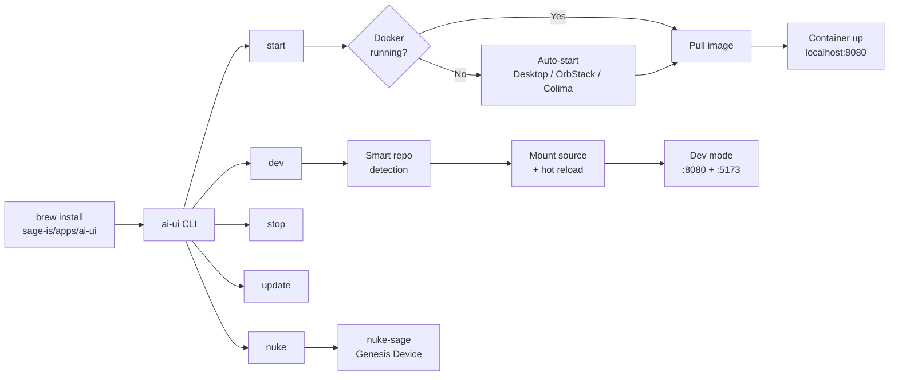
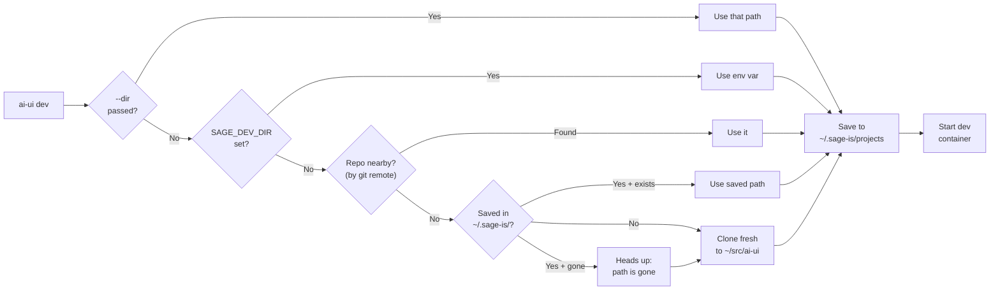
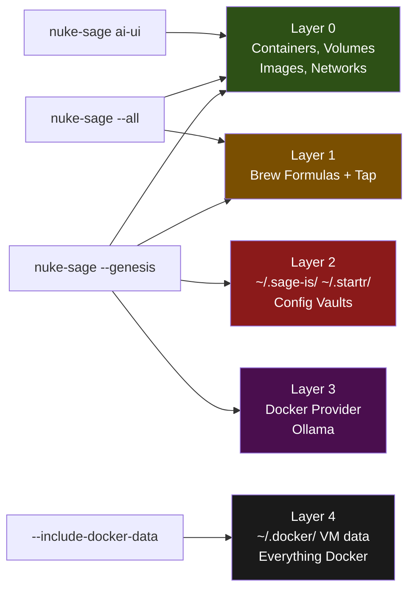
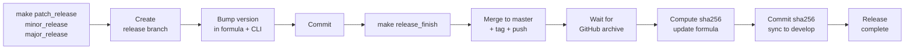
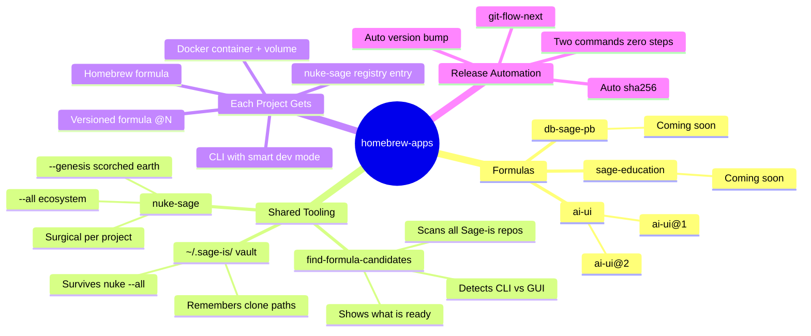

# homebrew-apps

**The Sage Homebrew Tap.** One command to install and run.

```bash
brew install sage-is/apps/ai-ui
```

That's it. You're running [Sage AI UI](https://github.com/Sage-is/AI-UI) locally.

## What you get

**ai-ui** — a CLI that deploys Sage AI UI to your machine via Docker. No config files, no YAML, no 47-step setup guide. Just:

```bash
ai-ui start
```

Open your browser, you're in. Private, local, yours.

### Commands

| Command | What it does |
|---------|-------------|
| `ai-ui start` | Pull the image and start the UI (port 8080) |
| `ai-ui stop` | Stop everything cleanly |
| `ai-ui update` | Pull the latest image and restart |
| `ai-ui dev` | Clone the source and run with hot reload |
| `ai-ui open` | Open the UI in your browser |
| `ai-ui logs` | Tail the container logs |
| `ai-ui status` | Check what's running |
| `ai-ui nuke` | Remove everything — clean slate |

Pass `--port 3000` to `start` or `dev` if 8080 is taken.

### How it flows



### Dev mode

Want to hack on the UI itself?

```bash
ai-ui dev --dir ~/src/ai-ui
```

This clones the repo (if needed), mounts the source into the container, and gives you Vite HMR on port 5173. Edit, save, see changes — the usual.

`ai-ui dev` is smart about finding your code. It checks by git remote — not folder name — so it works no matter what you called the directory.



Run `ai-ui dev --where` to see where your code is saved.

## Versioned installs

Need to pin a major version? We support that.

```bash
brew install sage-is/apps/ai-ui@1
```

The main `ai-ui` formula always tracks the latest. Versioned formulas (`ai-ui@1`, `ai-ui@2`, ...) let you lock to a major release — useful when stability matters more than features.

## Dependencies

- **Docker** — the container runtime (Docker Desktop, OrbStack, or Colima all work)
- **Ollama** — for local LLM inference

`ai-ui` auto-detects and starts your Docker provider if it's not already running. On macOS it checks Docker Desktop, OrbStack, and Colima in that order. If nothing's installed, it offers to set up Docker Desktop via Homebrew.

## Clean slate

Need to reset everything for testing or a fresh start? `nuke-sage` is the Genesis Device.

```bash
scripts/nuke-sage ai-ui           # remove just ai-ui
scripts/nuke-sage --all           # remove all Sage artifacts, keep config vault
scripts/nuke-sage --genesis       # scorched earth — everything goes
```

It scans, shows you exactly what it found, and asks before touching anything.



`--all` keeps your `~/.sage-is/` vault so clone paths survive — re-setup is instant. `--genesis` erases everything including the Docker provider itself. Add `--dry-run` to preview, `--yes` for CI.

## For contributors

This repo uses [git-flow-next](https://github.com/will-stone/git-flow-next) for releases. The Makefile handles the full workflow — version bumping, formula URL updates, sha256 computation, the works.

```bash
make help               # see all targets
make release            # interactive release flow
make patch_release      # start a patch bump
make release_finish     # merge, tag, push, update sha256
make check-upstream     # compare local version against upstream AI-UI
```



Release targets automatically update the formula URL, the CLI's VERSION string, and any matching versioned formulas. After tagging, `release_finish` waits for the GitHub archive to become available, computes the sha256, and commits it to both master and develop. Two commands, zero manual steps.

Major releases (`make major_release`) also create a versioned formula — `ai-ui@1`, `ai-ui@2`, etc. — so users can pin.

## The vision

This tap is the home for every Sage project that ships as a CLI or app. One repo, one `brew install`.



Run `./find-formula-candidates` to scan all Sage-is repos and see what's ready to become a formula — it auto-detects CLI tools vs GUI apps, checks for releases, and shows the full pipeline.

## License

[MIT](LICENSE)
