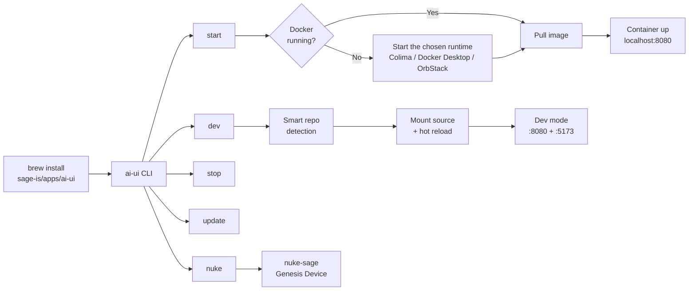
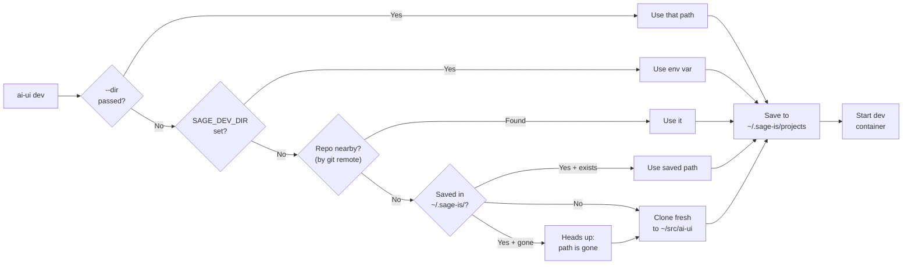
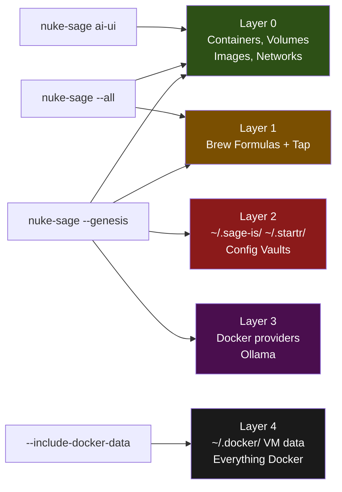
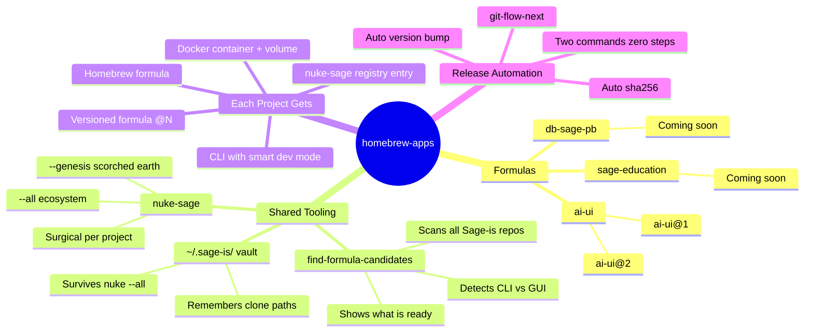

# homebrew-apps

**The Sage Homebrew Tap.** One line to install, one to run.

```bash
brew tap sage-is/apps && brew trust --tap sage-is/apps && brew install ai-ui
ai-ui start
```

That's it. You're running [Sage AI UI](https://github.com/Sage-is/AI-UI) locally on port 8080.

We are not in Homebrew's main catalogue yet. Homebrew 6 asks you to trust third-party taps, hence `brew trust`. Trusting the tap once covers every formula in it.

## What you get

**ai-ui** — a CLI that deploys Sage AI UI to your machine via Docker. No config files, no YAML, no 47-step setup guide. Just:

```bash
ai-ui start
```

Open your browser, you're in. Private, local, yours.

### Commands

| Command | What it does |
|---------|-------------|
| `ai-ui start` | Pull the image and start the UI (port 8080) |
| `ai-ui start --tag 2.3.1` | Pin a specific server version |
| `ai-ui start --runtime docker-desktop` | Keep Docker Desktop (or `orbstack`) instead of Colima; remembered |
| `ai-ui stop` | Stop everything cleanly |
| `ai-ui update` | Pull the latest image and restart |
| `ai-ui update --tag 2.3.1` | Switch to a specific server tag and restart |
| `ai-ui try` | Boot a try.sage trial (seeded personas, hidden LLM, 24h reset) |
| `ai-ui dev` | Clone the source and run with hot reload |
| `ai-ui open` | Open the UI in your browser |
| `ai-ui logs` | Tail the container logs |
| `ai-ui status` | Check what's running |
| `ai-ui nuke` | Remove everything — clean slate |

Pass `--port 3000` to `start`, `try`, or `dev` if 8080 is taken.

`--tag X.Y.Z` pins any release that has been published to `ghcr.io/sage-is/ai-ui` — see the [AI-UI releases](https://github.com/Sage-is/AI-UI/releases) page for the full list. Default is the server version this CLI pins; `--tag latest` runs the newest.

### How it flows


```mermaid
graph LR
    brew["brew install<br/>sage-is/apps/ai-ui"] --> cli["ai-ui CLI"]
    cli --> start["start"]
    cli --> dev["dev"]
    cli --> stop["stop"]
    cli --> update["update"]
    cli --> nuke["nuke"]

    start --> docker_check{"Docker<br/>running?"}
    docker_check -->|Yes| pull["Pull image"]
    docker_check -->|No| auto["Start the chosen runtime<br/>Colima / Docker Desktop / OrbStack"]
    auto --> pull
    pull --> run["Container up<br/>localhost:8080"]

    dev --> detect["Smart repo<br/>detection"]
    detect --> mount["Mount source<br/>+ hot reload"]
    mount --> devrun["Dev mode<br/>:8080 + :5173"]

    nuke --> genesis["nuke-sage<br/>Genesis Device"]
```

### Dev mode

Want to hack on the UI itself?

```bash
ai-ui dev --dir ~/src/ai-ui
```

This clones the repo (if needed), mounts the source into the container, and gives you Vite HMR on port 5173. Edit, save, see changes — the usual.

`ai-ui dev` is smart about finding your code. It checks by git remote — not folder name — so it works no matter what you called the directory.


```mermaid
graph LR
    run["ai-ui dev"] --> flag{"--dir<br/>passed?"}
    flag -->|Yes| use_dir["Use that path"]
    flag -->|No| env{"SAGE_DEV_DIR<br/>set?"}
    env -->|Yes| use_env["Use env var"]
    env -->|No| nearby{"Repo nearby?<br/>(by git remote)"}
    nearby -->|Found| use_nearby["Use it"]
    nearby -->|No| saved{"Saved in<br/>~/.sage-is/?"}
    saved -->|"Yes + exists"| use_saved["Use saved path"]
    saved -->|"Yes + gone"| warn["Heads up:<br/>path is gone"]
    saved -->|No| clone["Clone fresh<br/>to ~/src/ai-ui"]
    warn --> clone

    use_dir --> save["Save to<br/>~/.sage-is/projects"]
    use_env --> save
    use_nearby --> save
    use_saved --> save
    clone --> save
    save --> docker["Start dev<br/>container"]
```

Run `ai-ui dev --where` to see where your code is saved.

## Versioned installs

Need to pin a major version? We support that.

```bash
brew install ai-ui@3   # after the tap and trust step above: stays on AI-UI 3.x
```

The main `ai-ui` formula follows each AI-UI release. A versioned formula (`ai-ui@3`, `ai-ui@4`, ...) locks to one AI-UI major version; the first release of a new major creates the formula for the old one. `ai-ui@1` is the last CLI from before the numbers were synced: it stays at 1.0.4 and pulls the newest server.

For the *why* behind the two-file pattern (and the poka-yoke that keeps the v1 freeze from breaking when v2 ships), see [docs/versioned-formulas.md](docs/versioned-formulas.md).

## Dependencies

- **Colima** and the **Docker** CLI — the container runtime on macOS: no window, no sign-in, no licence screen
- **Ollama** — for local LLM inference

`ai-ui` starts the runtime when it is not running, and installs nothing at run time. A Mac that already uses Docker Desktop or OrbStack may keep it: the first `ai-ui start` asks which runtime to use when a Mac has more than one, and `--runtime colima|docker-desktop|orbstack` picks one directly. `ai-ui` remembers the choice in `~/.sage-is/runtime`, because each runtime keeps its own `sage-ai-data` volume.

Colima's first start creates a small Linux VM with Apple's own hypervisor and 4 GiB of memory; later starts leave its settings alone. Docker Desktop and OrbStack start hidden in the background once they have run before. Their first start stays in view, because it shows setup screens that need a click; sign-in is optional.

A Mac that once ran Docker Desktop may still name its credential helper in `~/.docker/config.json` (`"credsStore": "desktop"`). Without Docker Desktop that helper is gone and every pull fails, so `ai-ui` drops the key and keeps a dated backup beside the file.

## Clean slate

Need to reset everything for testing or a fresh start? `nuke-sage` is the Genesis Device.

```bash
ai-ui nuke                        # remove just ai-ui
ai-ui nuke --all                  # remove all Sage artifacts, keep config vault
ai-ui nuke --genesis              # scorched earth — everything goes
```

`ai-ui nuke` runs the copy of `nuke-sage` that the formula installs; in an AI-UI checkout, run `cli/nuke-sage` directly.

It scans, shows you exactly what it found, and asks before touching anything.


```mermaid
graph LR
    surgical["nuke-sage ai-ui"] --> L0
    all["nuke-sage --all"] --> L0 & L1
    genesis["nuke-sage --genesis"] --> L0 & L1 & L2 & L3

    L0["Layer 0<br/>Containers, Volumes<br/>Images, Networks"]
    L1["Layer 1<br/>Brew Formulas + Tap"]
    L2["Layer 2<br/>~/.sage-is/ ~/.startr/<br/>Config Vaults"]
    L3["Layer 3<br/>Docker providers<br/>Ollama"]

    genesis_dd["--include-docker-data"] --> L4["Layer 4<br/>~/.docker/ VM data<br/>Everything Docker"]

    style L0 fill:#2d5016,color:#fff
    style L1 fill:#7a4f01,color:#fff
    style L2 fill:#8b1a1a,color:#fff
    style L3 fill:#4a0e4e,color:#fff
    style L4 fill:#1a1a1a,color:#fff
```

`--all` keeps your `~/.sage-is/` vault so clone paths survive — re-setup is instant. `--genesis` erases everything, including every Docker provider on the Mac: Colima, Docker Desktop and OrbStack. Add `--dry-run` to preview, `--yes` for CI.

## The distribution.env contract

Three Sage repos — this one, [Sage-is/AI-UI](https://github.com/Sage-is/AI-UI), and [Sage-is/Sage.Education-docs](https://github.com/Sage-is/Sage.Education-docs) — each keep an ordinary copy of `distribution.env`: image registry, server tag, volume name, install command, CLI version. This repo owns `CLI_VERSION`; AI-UI owns `SERVER_TAG`. The copies were hard-linked until 2026-08-13; the file's header says why that ended.

```bash
make distribution_sync       # publish this repo's copy to the siblings
make distribution_verify     # refuse while a copy differs or the pinned server image is missing on GHCR
```

`ai_ui_formula` depends on `distribution_verify`, so the formula never points at a release whose image or copies are missing. That's the Jidoka (自働化) primitive: the machine stops itself.

The brew formula installs `distribution.env` next to the `ai-ui` script, so a brew install pins the server version its release was tested with. `ai-ui version` shows both, for example `ai-ui 3.2.0 (server 3.2.0)`.

## cr-deploy

**cr-deploy** deploys to CapRover from the terminal by image digest and checks that the new version answers. If it does not, `cr-deploy rollback` runs the previous one. AI-UI's `make deploy` and Trellis's caprover targets use it.

```bash
brew tap sage-is/apps && brew trust --tap sage-is/apps && brew install cr-deploy
```

```bash
cr-deploy apps
cr-deploy apps sage-startr-cloud
cr-deploy deploy-image APP ghcr.io/org/image@sha256:... --verify https://HOST/api/config --expect version=1.2.3 --health https://HOST/health
cr-deploy rollback APP
```

See `man cr-deploy`. It was called `captain` before its first release; that command still works, with a warning, until cr-deploy 0.2.0.

## offload

**offload** moves heavy data from the Mac to external drives by symlink, safely.

```bash
brew tap sage-is/apps && brew trust --tap sage-is/apps && brew install offload
```

```bash
offload status
offload drain
```

See `man offload`.

## comicreel

**comicreel** makes any movie a comic, and any comic a movie, in a browser app that runs on your Mac. It was called storyboarder. The app's repository is private for now, so launching needs GitHub access to it.

```bash
brew tap sage-is/apps && brew trust --tap sage-is/apps && brew install comicreel
```

```bash
comicreel
```

## git-release

**git-release** is one-command git-flow release for repos with the standard release Makefile targets.

```bash
brew tap sage-is/apps && brew trust --tap sage-is/apps && brew install git-release
```

```bash
git-release patch
```

A repo's `make release` runs it from PATH, so repos keep no copy of their own. [startr.sh](https://startr.sh/scripts/release.sh) publishes the same file for projects without brew.

## mdprose

**mdprose** is Markdown prose hygiene: unwrap hard-wrapped paragraphs, strip stray whitespace.

```bash
brew tap sage-is/apps && brew trust --tap sage-is/apps && brew install mdprose
```

```bash
mdprose report docs/
mdprose fix README.md
```

## work-delegation

**work-delegation** hands file edits to cheaper models via delegate-edit and returns a diff to review.

```bash
brew tap sage-is/apps && brew trust --tap sage-is/apps && brew install work-delegation
```

```bash
delegate-edit --doctor
```

## Mac apps

Run the tap and trust line at the top first; then:

**todoscope** shows every TODO across your repos as a kanban board.

```bash
brew install --cask todoscope
```

**downes** is a course-design studio for teachers.

```bash
brew install --cask downes
```

**mini** is Sage.is AI-UI mini.

```bash
brew install --cask mini
```

**talking** is offline two-way voice.

```bash
brew install --cask talking
```

## One version number

Since 2026-09-30 the `ai-ui` CLI lives in AI-UI's `cli/` folder and ships inside every AI-UI release. Its version is the AI-UI version it pins. `ai-ui version` shows both numbers; they match.

After each AI-UI release (`make ship` there writes the new `SERVER_TAG` into `distribution.env` here), run `make ai_ui_formula`. It points `Formula/ai-ui.rb` and the matching `ai-ui@N` at that release's tarball and fills the sha256. The first release of a new major keeps the old major as `ai-ui@<old>`.

A fix to the CLI alone ships in the next AI-UI release; four-number hotfixes stay AI-UI's. `3.2.0_2` was the last CLI built from this tap.

`ai-ui start --tag X.Y.Z` still runs any other server version, and `--tag latest` the newest. AI-UI's [CHANGELOG](https://github.com/Sage-is/AI-UI/blob/master/CHANGELOG.md) lists what each release changed.

## For contributors

This repo uses [git-flow-next](https://github.com/will-stone/git-flow-next) for feature work. **The Sage projects use feature branches, not pull requests, as the primary contribution flow.** The reason is portability: git-flow works against any git remote — self-hosted, mirrored, federated — not just centralized SaaS. A deliberate stance on resilience, not stylistic preference.

```bash
git flow feature start <feature-name>    # create branch
# ... do the work ...
git flow feature finish <feature-name>   # merge into develop, delete branch
git push origin develop                  # push to whichever remote you use
```

PRs are accepted but not the primary path.

```bash
make help                           # every target
make ai_ui_formula                  # after an AI-UI release: point the ai-ui formula at it
make tool_release TOOL=x VERSION=y  # release one of the other tools
make release_tools                  # release every tool that is behind
make check                          # before a push
```

`ai-ui` follows AI-UI's releases through `make ai_ui_formula`; the other tools release with `make tool_release`.

## The vision

This tap is the home for every Sage project that ships as a CLI or app. One repo, one `brew install`.


```mermaid
mindmap
  root((homebrew-apps))
    Formulas
      ai-ui
        ai-ui@1
        ai-ui@2
      db-sage-pb
        Coming soon
      sage-education
        Coming soon
    Shared Tooling
      nuke-sage
        Surgical per project
        --all ecosystem
        --genesis scorched earth
      find-formula-candidates
        Scans all Sage-is repos
        Detects CLI vs GUI
        Shows what is ready
      ~/.sage-is/ vault
        Remembers clone paths
        Survives nuke --all
    Each Project Gets
      Homebrew formula
      Versioned formula @N
      CLI with smart dev mode
      Docker container + volume
      nuke-sage registry entry
    Release Automation
      git-flow-next
      Auto version bump
      Auto sha256
      Two commands zero steps
```

Run `./find-formula-candidates` to scan all Sage-is repos and see what's ready to become a formula — it auto-detects CLI tools vs GUI apps, checks for releases, and shows the full pipeline.

## License

[MIT](LICENSE)
